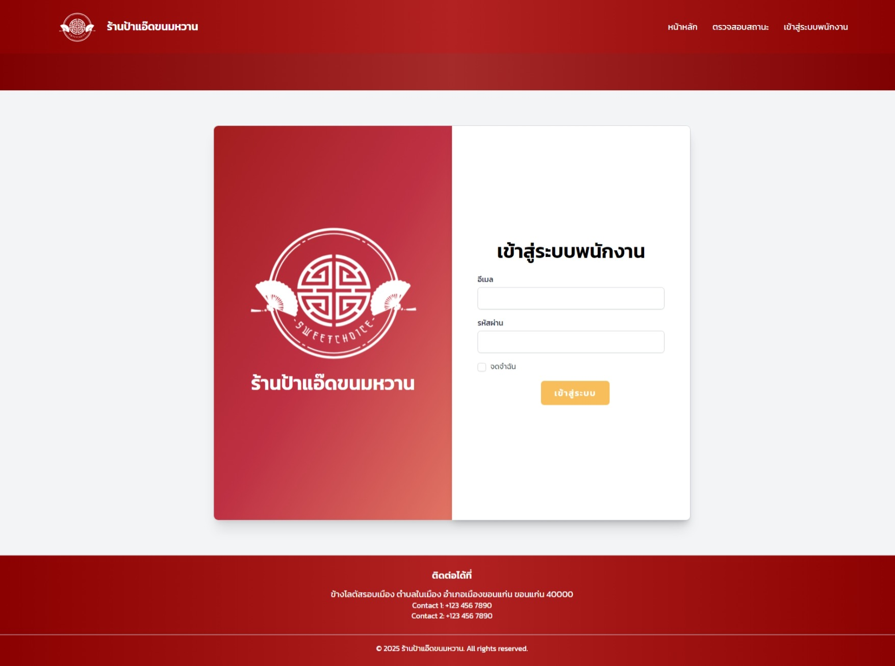

# Dessert Management System
'A web application for managing dessert orders, for a shop during festival seasons, developed by Laravel and MySQL.
Focuses on database design and backend order processing.'

## Features

- Order creation and management
- Items & Festival creation and management
- User registeration
- Admin dashboard for managing items and orders
- Order status workflow

## TechStack

- PHP (Laravel)
- MySQL (phpMyAdmin)
- HTML/CSS, JavaScript (BootStrap5)

## What I Learned

- Designing SQL Database for business workflows
- Applying database normalization principles
- Developing and testing Laravel-based application

## Screenshots

### Login for employee

